# 自动投食器
## 1、简介
&emsp;&emsp;
自动投食器是一种可以自动投喂宠物粮的设备，致力于解决当家中无人时宠物无法喂养的问题。该设备具备云端接入能力，可通过手机进行控制，拥有两种投喂模式可供选择，即在手机端手动点击投喂，或定时进行周期性的投喂；另外，还可对剩余宠物粮进行实时监控，方便用户实时了解宠物们碗中是否有粮可吃。

### 1.1、准备
硬件列表
* Haas EDU K1开发板一个  
* 电源转接板一个  
* 步进电机及uln2003驱动板一套  
* HX711电子秤传感器一个  
* 杜邦连接线若干  

Haas EDU K1开发板与转接板、步进电机及电子秤传感器之间的硬件连线
<table>
    <tr>
        <td align="center">硬件</td>
        <td align="center">uln2003步进电机驱动板</td>
        <td align="center">HX711电子秤传感器</td>
        <td align="center">Haas EDU K1开发板</td>
        <td align="center">电源转接板</td>
    </tr>
    <tr>
        <td align="center" rowspan="9">端口标识</td>
        <td align="center">GND</td>
        <td align="center">GND</td>
        <td align="center">GND</td>
        <td align="center">GND</td>
    </tr>
    <tr>
        <td align="center">-</td>
        <td align="center">VCC</td>
        <td align="center">3.3V</td>
        <td align="center">-</td>
    </tr>
    <tr>
        <td align="center">VCC</td>
        <td align="center">-</td>
        <td align="center">-</td>
        <td align="center">5V</td>
    </tr>
    <tr>
        <td align="center">IN1</td>
        <td align="center">-</td>
        <td align="center">P04</td>
        <td align="center">P04</td>
    </tr>
    <tr>
        <td align="center">IN2</td>
        <td align="center">-</td>
        <td align="center">P05</td>
        <td align="center">P05</td>
    </tr>
    <tr>
        <td align="center">IN3</td>
        <td align="center">-</td>
        <td align="center">P06</td>
        <td align="center">P06</td>
    </tr>
    <tr>
        <td align="center">IN4</td>
        <td align="center">-</td>
        <td align="center">P07</td>
        <td align="center">P07</td>
    </tr>
    <tr>
        <td align="center">-</td>
        <td align="center">CLK</td>
        <td align="center">P02</td>
        <td align="center">P02</td>
    </tr>
    <tr>
        <td align="center">-</td>
        <td align="center">DT</td>
        <td align="center">P03</td>
        <td align="center">P03</td>
    </tr>
    <tr>
        <td align="center" rowspan="1">硬件说明</td>
        <td> <a align="center" href="https://haas.iot.aliyun.com/solution/detail/hardware?versionId=800C4A7B94BEA8CA00000001&dataId=800C4A7B94BEA8CA" target="_blank">步进电机驱动器详情</td>
        <td align="center" >-</td>
        <td> <a align="center" href="https://haas.iot.aliyun.com/solution/detail/hardware?versionId=800C5AB3B8A4A88800000001&dataId=800C5AB3B8A4A888" target="_blank">快速开始详细端口定义</td>
        <td align="center" >-</td>
    </tr>
</table>

&emsp;&emsp;
硬件连线图如下所示：
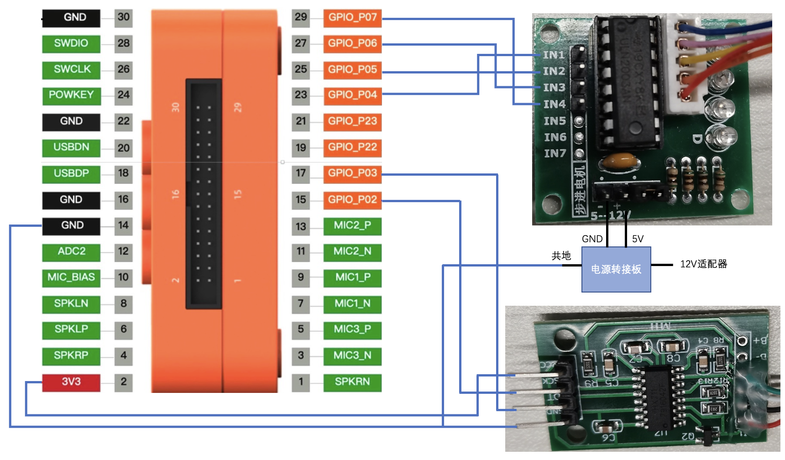


## 2、物联网平台开发

&emsp;&emsp;
整个过程包含以下3个步骤：

2. 创建产品（设备模型）
3. 定义产品功能（物模型）
4. 创建设备及获取三元组

&emsp;&emsp;
对于第一次使用物联网平台的读者，需要开通实例以使用物联网平台的功能。这里可以使用免费的公共实例进行开发。

&emsp;&emsp;
在[物联网平台](https://iot.console.aliyun.com/lk/summary/new)中，左上角选择“华东2-上海”，点击“公共实例”，即可开通。开通后点击“公共实例”，即可进入[控制台](https://iot.console.aliyun.com/lk/summary/new)进行产品创建。


### 2.1、创建产品（设备模型）
&emsp;&emsp;
进入[公共实例控制台](https://iot.console.aliyun.com/lk/summary/new)，点击“创建产品”按钮，即可进入[新建产品页面](https://iot.console.aliyun.com/product)。


&emsp;&emsp;
进入[新建产品页面](https://iot.console.aliyun.com/product)，设定“产品名称”，这里我们命名为“**宠物粮投喂器**”，读者也可以根据自己的喜好来命名。在“所属品类”中，选择“自定义品类”。

&emsp;&emsp;
产品的节点类型选择“直连设备”，数据格式选择“ICA标准数据格式”，检验类型和认证方式选择默认设定即可。开发者可根据自己的需求在“产品描述”页面添加针对此产品的描述。

&emsp;&emsp;
对于搭载 Wi-Fi 的设备而言，联网方式选择“Wi-Fi”。

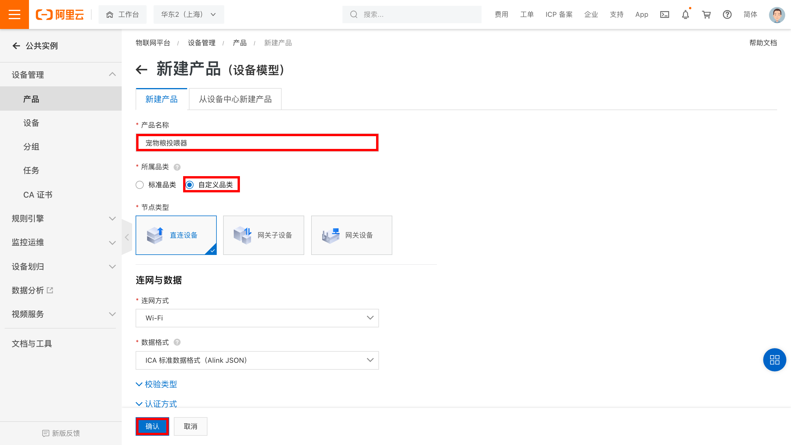

&emsp;&emsp;
点击“确认”按钮，即可完成产品创建。


&emsp;&emsp;
点击“前往定义物模型”

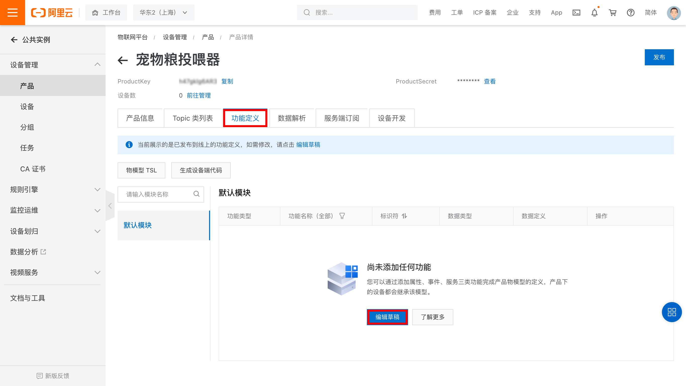

### 2.2、定义产品功能（物模型）
&emsp;&emsp;
进入功能定义，点击编辑草稿，选择添加自定义功能，依次添加“自动投喂开关”“投喂计数清零”“手动投喂”“已投喂次数”“剩余宠物粮”五个功能项，如下所示：
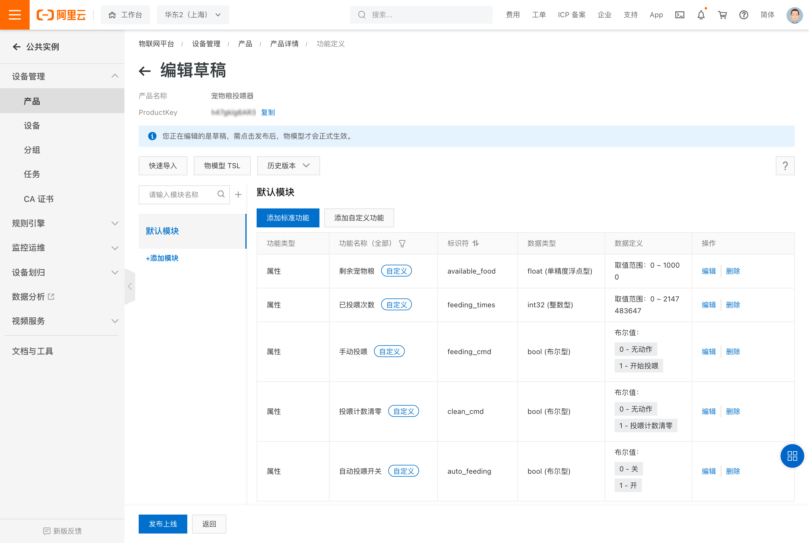

&emsp;&emsp;
定义好物模型后，需要发布物模型上线，并发布产品，以使变更生效。


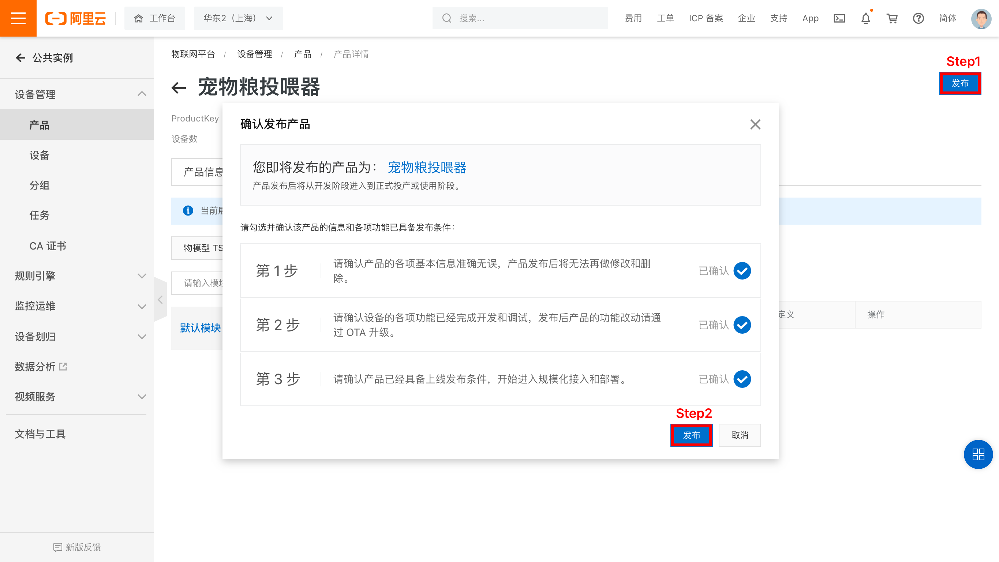

&emsp;&emsp;
产品及其物模型创建完成后就可以创建这个产品的设备了。

### 2.3、创建设备及获取三元组
&emsp;&emsp;
点击左侧栏中“设备“，在筛选框中选择要添加设备的产品，点击“添加设备”。这里这里我们命名为“**pet_food_feeder**”，开发者也可以根据自己的喜好来命名。

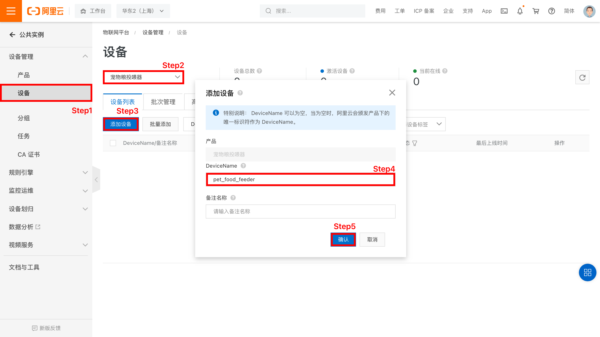

&emsp;&emsp;
生成的设备如下。


&emsp;&emsp;
点击前往“查看”按钮，就可以看到此设备的详细信息了。
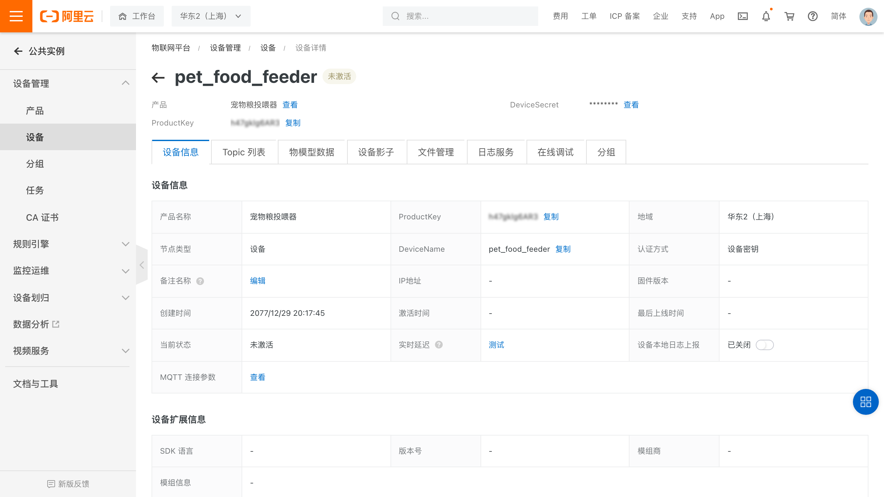

&emsp;&emsp;
点击右上角的“查看”按钮，就能看到设备的三元组信息了。
三元组是物联网设备端和物联网云端设备相关联的唯一标识符，在设备端连接云端的时候会使用三元组信息和云端进行鉴权，鉴权通过之后云端会认为设备已激活并上线。

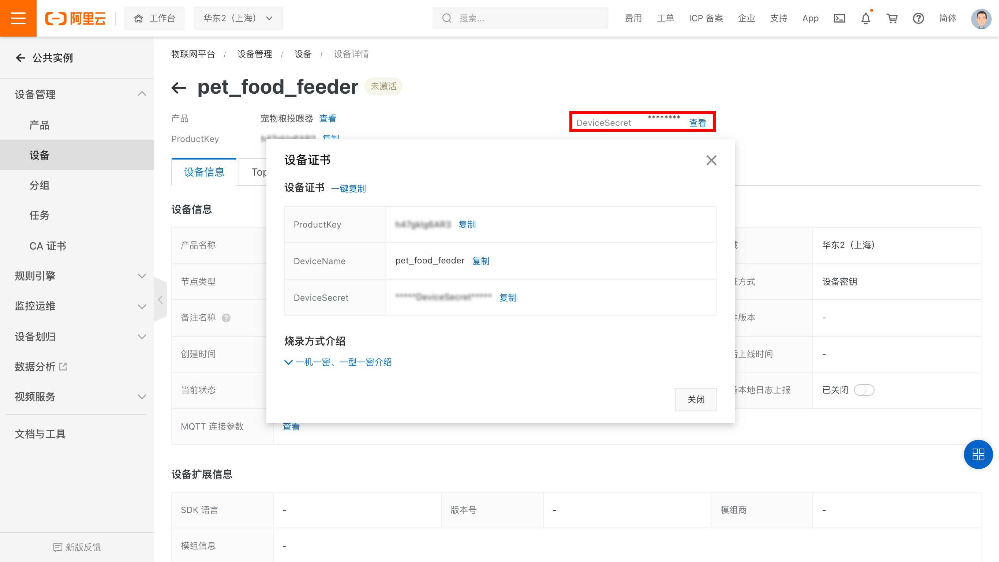

&emsp;&emsp;
再次前往物联网平台的设备信息页面，若设备运行正确，此时应该可以看到设备名右侧的状态由“未激活”变为“在线”。
选中“实时刷新”，可以看到数据实时从设备上报到物联网平台。设备上云成功。

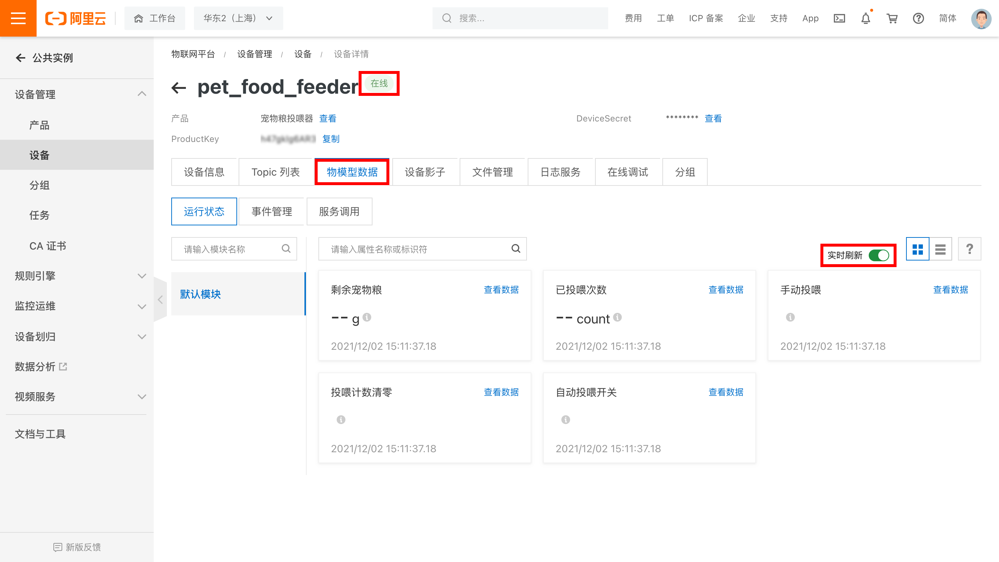

## 3、设备端开发
### 3.1、开发环境
&emsp;&emsp;
在进行下一步之前请确保HaaS EDU K1开发环境已经搭建完毕。详情请参考[HaaS EDU K1开发环境](https://haas.iot.aliyun.com/haasapi/index.html?spm=a2cpu.b16145223.0.0.665960b1PR2nSt#/Python/docs/zh-CN/startup/HaaS_EDU_K1_startup)的说明。

### 3.2、创建解决方案

&emsp;&emsp;
如下图所示，在Haas Studio中创建项目。先选择左侧的“开发板型号”再从右侧的案例中选择“自动投食器”案例点击“立即创建”即可。

<div align="center">

</div>
<br>

1. **填写Wi-Fi名称及密码**

&emsp;&emsp;
在main.py中，填写可用的Wi-Fi名称及密码。

``` python
# wifi连接的的ssid和pwd定义
wifi_ssid = "请填写您的路由器名称"
wifi_password = "请填写您的路由器密码"
```

2. **修改设备端三元组**

&emsp;&emsp;
在main.py中，填写创建的设备三元组信息。关于设备三元组的获取，请参考[创建设备及获取三元组](./README.md "创建设备及获取三元组")中的步骤。

``` python
# 三元组信息
productKey     = "产品key"
deviceName     = "设备名称"
deviceSecret   = "设备密钥"
```

## 4、物联网应用开发
&emsp;&emsp;
IoT Studio 提供了应用快速开发的能力，可以很方便地与物联网平台进行联动。本节的开发工作也将围绕 IoT Studio展开。

### 4.1、新建“普通项目”
&emsp;&emsp;
打开IoT Studio官网，在项目管理中新建一个空白项目，如下图所示，将此项目命名为“**宠物粮投喂器**”,开发者也可以根据自己的喜好来命名。


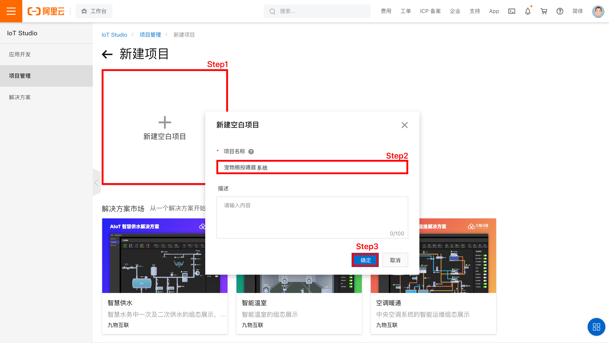

### 4.2、关联产品与设备
&emsp;&emsp;
为了使本项目能够获取到目标设备的信息，我们首先需要将该项目和我们在前一节创建的产品及设备绑定。

&emsp;&emsp;
在项目控制台，点击左侧的“产品”，点击“关联物联网平台产品”。此时可以看见我们创建的“宠物粮投喂器”。点击选中，并勾选“关联产品同时关联其下所有设备”，以便该项目可以访问到所有设备的信息。

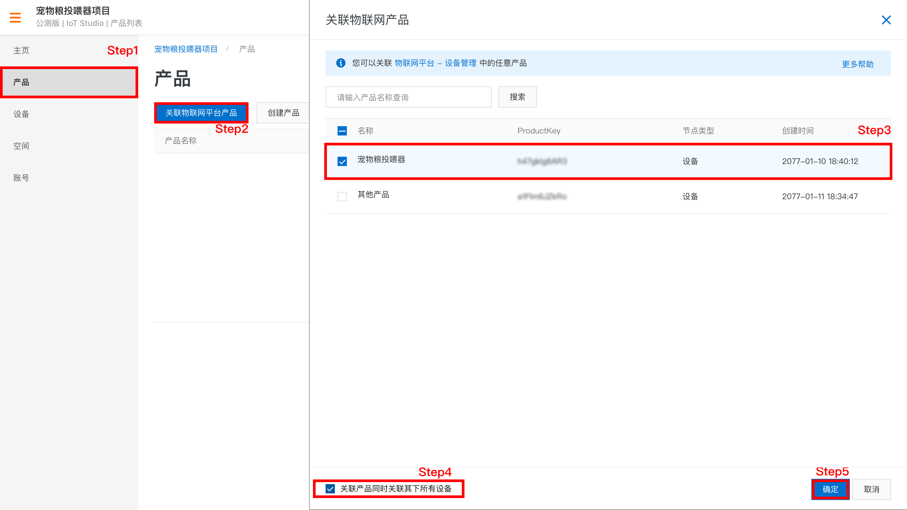
&emsp;&emsp;
在项目控制台，点击左侧的“设备”，点击“关联物联网平台设备”。此时可以看见我们创建的“pet_food_feeder”。点击选中。
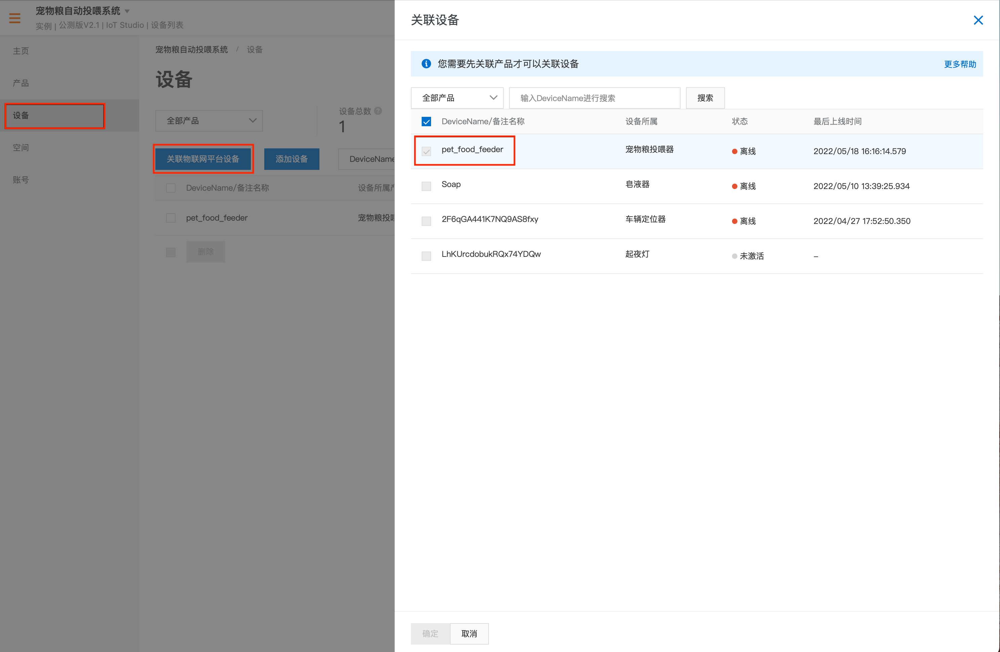
### 4.3、创建“移动应用”
&emsp;&emsp;
在项目控制台，点击左侧主页，选择刚刚创建的项目，选择移动应用-新建，填写应用名称，最后点击确定来完成创建。


### 4.4、编辑“移动应用”
&emsp;&emsp;
点击编辑进入应用的编辑页面
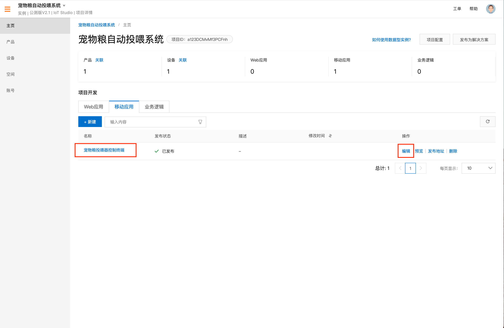
&emsp;&emsp;
编辑应用标题

&emsp;&emsp;
编辑自动投喂控制开关，并添加时间显示控件

&emsp;&emsp;
编辑余粮统计控件，用于实时显示宠物粮剩余情况

&emsp;&emsp;
编辑投喂次数显示控件，用于显示宠物粮已投放次数

&emsp;&emsp;
编辑投喂次数清零控件，用于将宠物粮投放次数显示清零
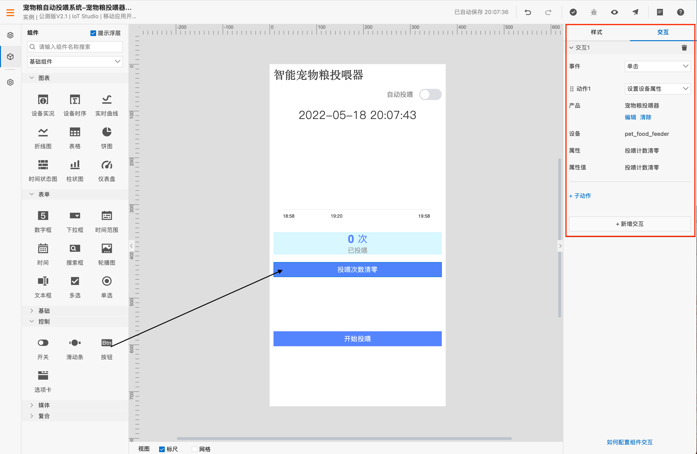
&emsp;&emsp;
编辑开始投喂控件，用于远程手动控制宠物粮投放

&emsp;&emsp;
点击右上角的保存按钮，之后可通过预览按钮进行预览,也可通过手机扫描二维码然后在手机端进行控制。

&emsp;&emsp;
预览确认无误后，便可通过右上角的发布按钮将应用正式发布使用。