# 颜色分拣器
&emsp;&emsp;
下图是本案例的三步导学。
<div align="center">

</div>

## 1、简介
### 1.1、背景
&emsp;&emsp;
当不同颜色的物体混合在一起时，如何将它们按照颜色分开是一个令人头疼的问题。

&emsp;&emsp;
本案例采用ESP32开发板，通过TCS34725颜色识别传感器对不同颜色的糖豆进行识别，并结合舵机进行分拣，搭建了一套低成本、易实现的颜色分拣器。基于阿里云物联网平台，创建了Web应用，可在Web应用上控制机器开关，查看分拣结果的统计数据。

### 1.2、准备

1. [ESP32开发板](https://haas.iot.aliyun.com/solution/detail/hardware?versionId=800C0A5C37AADCDB00000001&dataId=800C0A5C37AADCDB) 一套
2. [TCS34725颜色传感器](https://haas.iot.aliyun.com/solution/detail/hardware?versionId=800C6B2475B96C4A00000001&dataId=800C6B2475B96C4A&s=) 一个
3. [SG90舵机](https://haas.iot.aliyun.com/solution/detail/hardware?versionId=800C5A3F64C2F88300000001&dataId=800C5A3F64C2F883&s=) 两个
4. 杜邦线 若干

涉及到的硬件购买链接如下，仅供参考，不负责商家发货的品质保障等问题！

| 名称 | 数量 | 参考链接 |
| --- | --- | --- |
| ESP32开发板 | 1套 | [ESP32开发板](https://haas.iot.aliyun.com/solution/detail/hardware?versionId=800C0A5C37AADCDB00000001&dataId=800C0A5C37AADCDB)|
| SG90角度舵机 | 2个 | [舵机](https://detail.tmall.com/item.htm?spm=a230r.1.14.16.737613fdaUg7NB&id=41248626148&ns=1&abbucket=9&skuId=4167665919053) |
| TCS34725颜色传感器 | 1个 | [TCS34725颜色传感器](https://detail.tmall.com/item.htm?spm=a1z10.3-b-s.w4011-16538328900.23.6de73d6cw3Ie3b&id=41323693774&rn=f66df8af8849c95281a65f445d9b615a&abbucket=11) |
| 母对母杜邦线 | 若干 | [母对母杜邦线](https://detail.tmall.com/item.htm?id=14466195609&ali_refid=a3_430582_1006:1104520036:N:MsF9mE9KLTC2IibWJh+K1A==:21c5b519e28c4b0cd17ec4383141281f&ali_trackid=1_21c5b519e28c4b0cd17ec4383141281f&spm=a230r.1.14.1&skuId=3108214440213) 请选用10cm长即可 |
| 公对母杜邦线 | 若干 | [公对母杜邦线](https://detail.tmall.com/item.htm?id=14466195609&ali_refid=a3_430582_1006:1104520036:N:MsF9mE9KLTC2IibWJh+K1A==:21c5b519e28c4b0cd17ec4383141281f&ali_trackid=1_21c5b519e28c4b0cd17ec4383141281f&spm=a230r.1.14.1&skuId=3108214440213) 请选用10cm长即可 |

&emsp;&emsp;
硬件连线图如下图所示：
<div align="center">

</div>
<br>

## 2、物联网平台开发
&emsp;&emsp;
整个过程包含以下4个步骤：

1. 开通公共实例
2. 创建产品（设备模型）
3. 定义产品功能（物模型）
4. 创建设备及获取三元组

### 2.1、开通公共实例
&emsp;&emsp;
对于第一次使用物联网平台的读者，需要开通实例以使用物联网平台的功能。这里可以使用免费的公共实例进行开发。

&emsp;&emsp;
在[物联网平台](https://iot.console.aliyun.com/lk/summary/new)中，左上角选择“华东2-上海”，点击“公共实例”，即可开通。开通后点击“公共实例”，即可进入[控制台](https://iot.console.aliyun.com/lk/summary/new)进行产品创建。


### 2.2、创建产品（设备模型）
&emsp;&emsp;
进入[公共实例控制台](https://iot.console.aliyun.com/lk/summary/new)，点击“创建产品”按钮，即可进入[新建产品页面](https://iot.console.aliyun.com/product)。


&emsp;&emsp;
进入[新建产品页面](https://iot.console.aliyun.com/product)，设定“产品名称”，这里我们命名为“**颜色分拣器**”，读者也可以根据自己的喜好来命名。在“所属品类”中，选择“自定义品类”。

&emsp;&emsp;
产品的节点类型选择“直连设备”，数据格式选择“ICA标准数据格式”，检验类型和认证方式选择默认设定即可。开发者可根据自己的需求在“产品描述”页面添加针对此产品的描述。

&emsp;&emsp;
对于 ESP32 等搭载 Wi-Fi 的设备而言，联网方式选择“Wi-Fi”。

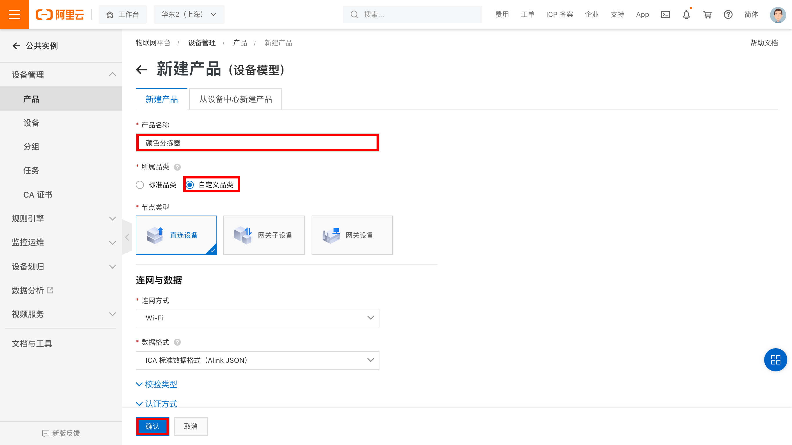

&emsp;&emsp;
点击“确认”按钮，即可完成产品创建。

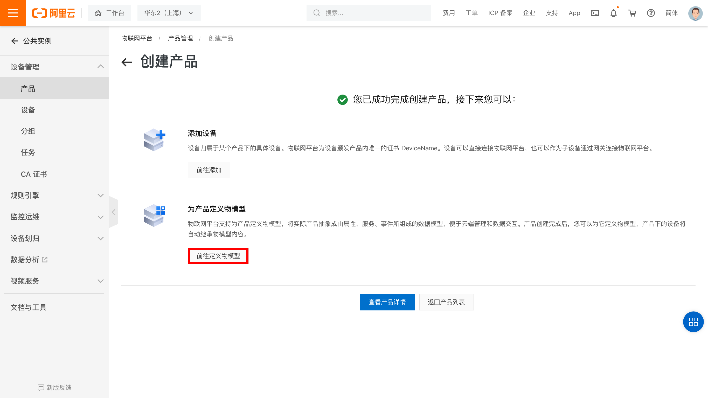

&emsp;&emsp;
点击“前往定义物模型”

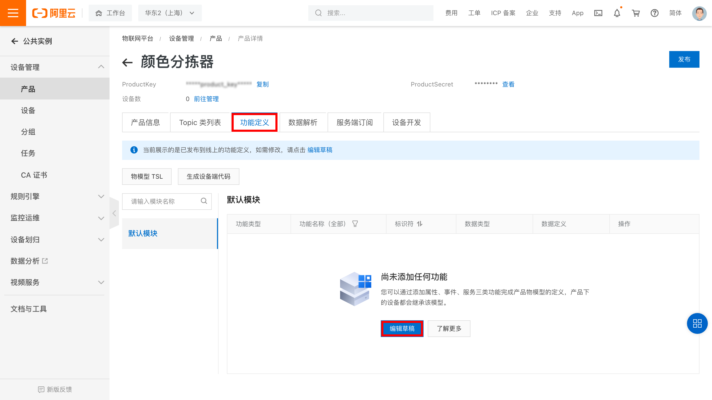

### 2.3、定义产品功能（物模型）
&emsp;&emsp;
开发者可以使用准备好的[物模型文件](./link_platform/model.zip)来进行快速导入。点击左上角“快速导入”，选择物模型文件并上传，就能够生成案例对应的物模型。

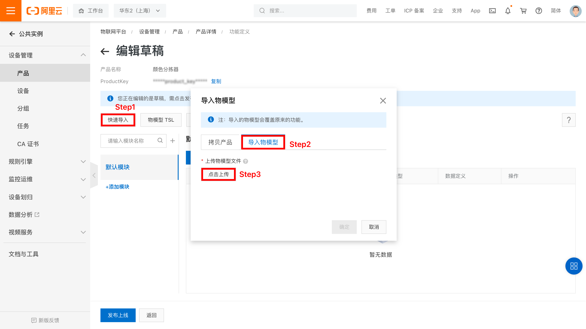

&emsp;&emsp;
生成后的效果如下：


&emsp;&emsp;
定义好物模型后，需要发布物模型上线，并发布产品，以使变更生效。

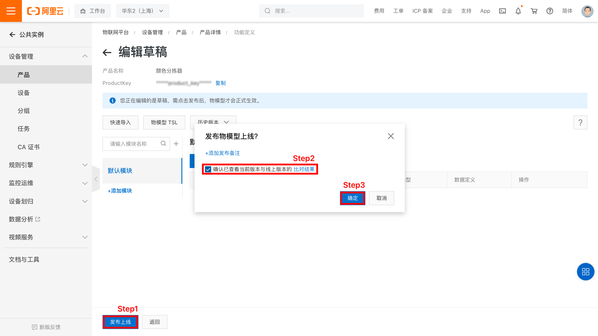

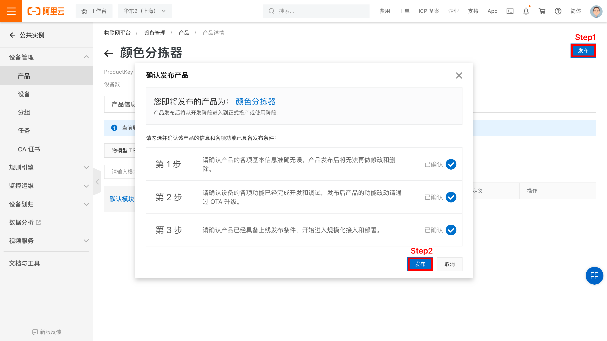

&emsp;&emsp;
产品及其物模型创建完成后就可以创建这个产品的设备了。

### 2.4、创建设备及获取三元组
&emsp;&emsp;
点击左侧栏中“设备“，在筛选框中选择要添加设备的产品，点击“添加设备”。这里这里我们命名为“**color_sorter**”，开发者也可以根据自己的喜好来命名。

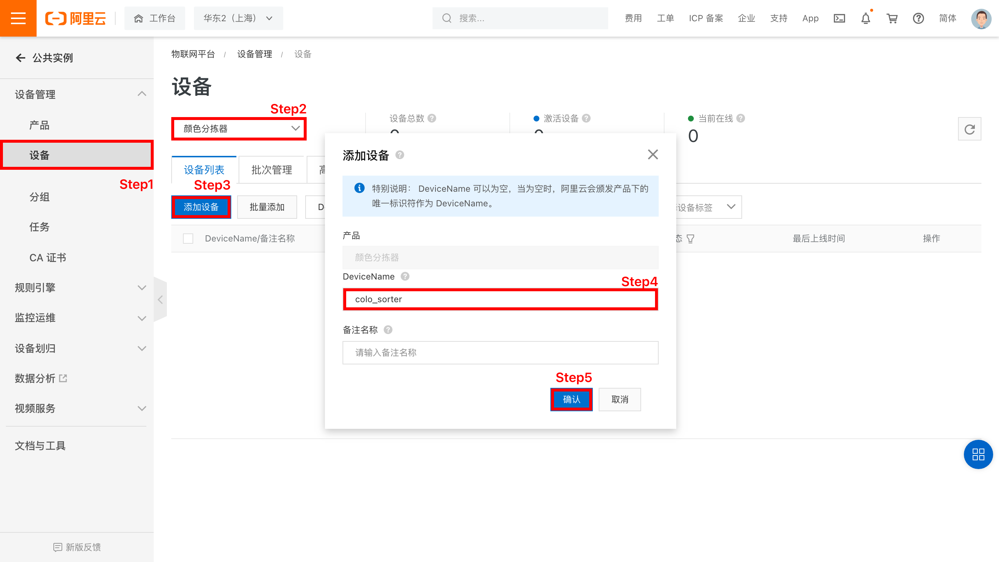

&emsp;&emsp;
开发者也可以选择“批量添加”，一次性添加多个设备，并生成随机的DeviceName。

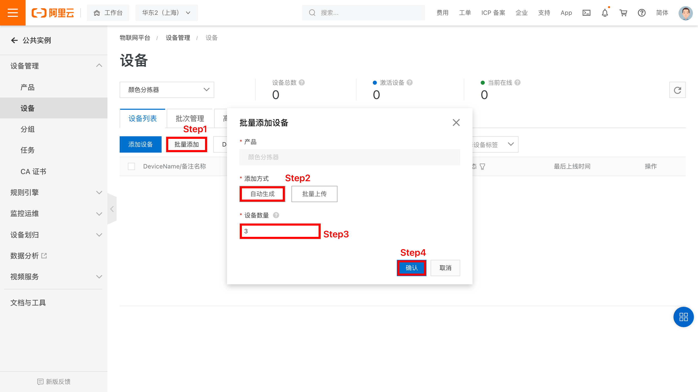

&emsp;&emsp;
生成的设备如下。

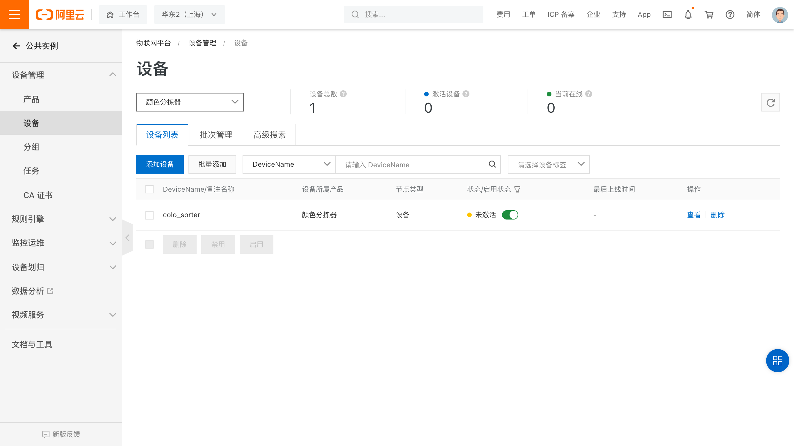

&emsp;&emsp;
点击前往“查看”按钮，就可以看到此设备的详细信息了。
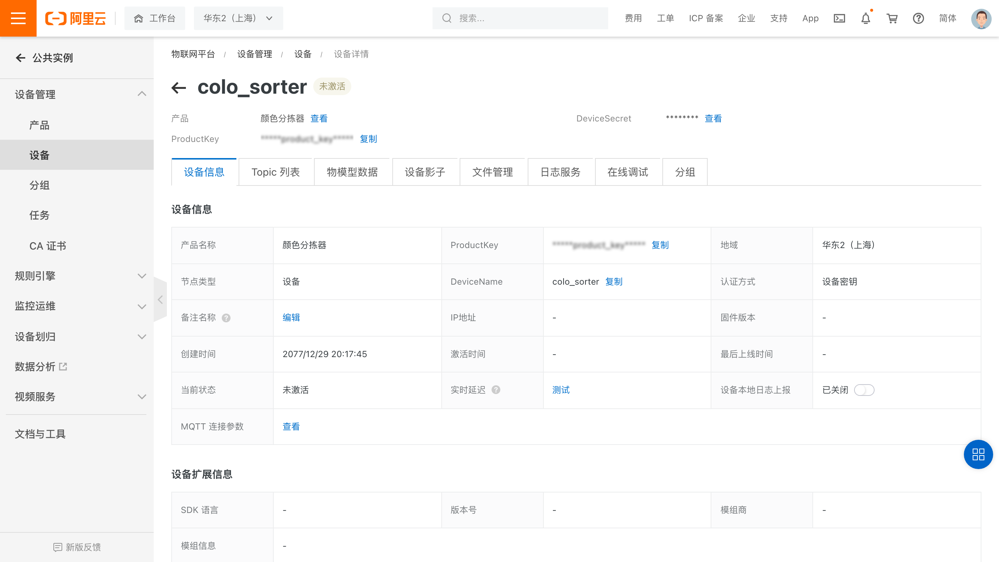

&emsp;&emsp;
点击右上角的“查看”按钮，就能看到设备的三元组信息了。
三元组是物联网设备端和物联网云端设备相关联的唯一标识符，在设备端连接云端的时候会使用三元组信息和云端进行鉴权，鉴权通过之后云端会认为设备已激活并上线。

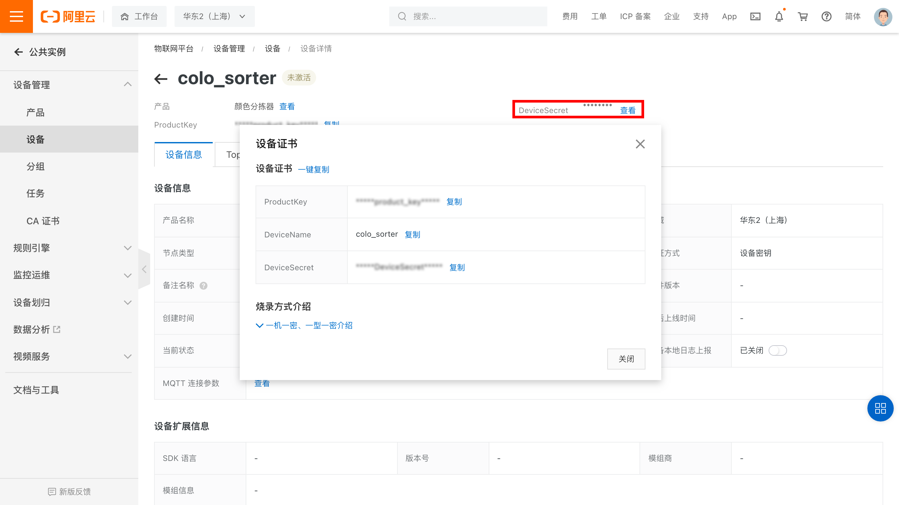


## 3、设备端开发
### 3.1、开发环境
&emsp;&emsp;
在进行下一步之前请确保ESP32开发环境已经搭建完毕。详情请参考[ESP32开发环境](https://haas.iot.aliyun.com/haasapi/index.html?spm=a2cpu.b16145223.0.0.665960b1PR2nSt#/Python/docs/zh-CN/startup/ESP32_startup)的说明。

### 3.2、创建解决方案

&emsp;&emsp;
如下图所示，在Haas Studio中创建项目。先选择左侧的“开发板型号”再从右侧的案例中选择“颜色分拣器”案例点击“立即创建”即可。

<div align="center">

</div>
<br>

&emsp;&emsp;
创建工程后，需要进行如下设定完成设备端代码的开发。
1. **填写Wi-Fi名称及密码**

&emsp;&emsp;
在main.py中，填写可用的Wi-Fi名称及密码。

``` python
# wifi连接的的ssid和pwd定义
wifi_ssid = "请填写您的路由器名称"
wifi_password = "请填写您的路由器密码"
```

2. **修改设备端三元组**

&emsp;&emsp;
在main.py中，填写创建的设备三元组信息。关于设备三元组的获取，请参考2.4节**创建设备及获取三元组**中的步骤。

``` python
# 三元组信息
productKey     = "产品key"
deviceName     = "设备名称"
deviceSecret   = "设备密钥"
```
## 4、物联网应用开发

&emsp;&emsp;
IoT Studio 提供了应用快速开发的能力，可以很方便地与物联网平台进行联动。本节的开发工作也将围绕 IoT Studio展开。

### 4.1、新建“普通项目”
&emsp;&emsp;
打开IoT Studio官网，在项目管理中新建一个空白项目，如下图所示，将此项目命名为“**颜色分拣器**”,开发者也可以根据自己的喜好来命名。


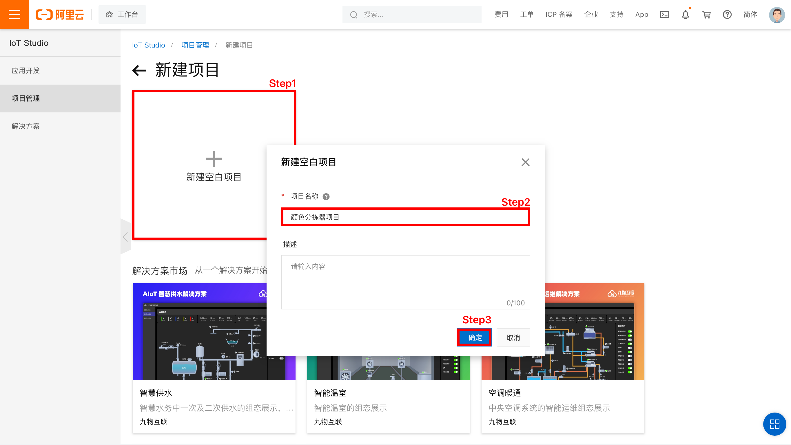

### 4.2、关联产品

&emsp;&emsp;
为了使本项目能够获取到目标设备的颜色识别信息，我们首先需要将该项目和我们在前一节创建的产品“颜色分拣器”绑定。

&emsp;&emsp;
在项目控制台，点击左侧的“产品”，点击“关联物联网平台产品”。此时可以看见我们创建的“颜色分拣器”。点击选中，并勾选“关联产品同时关联其下所有设备”，以便该项目可以访问到所有设备上报的属性值。

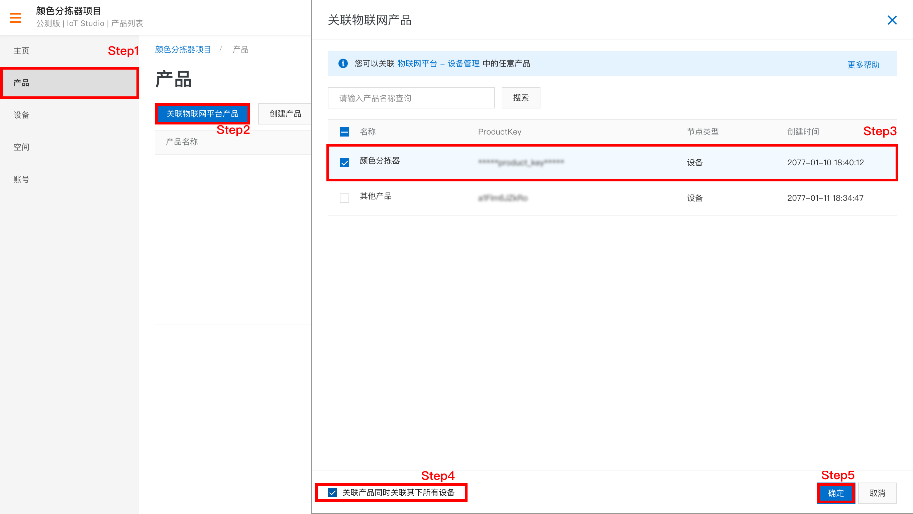

### 4.3、创建“Web应用”


### 4.4、“Web应用”开发
&emsp;&emsp;
从左侧组件栏中选择颜色分拣器应用需要的组件，将其拖入中间的窗口，按自己的喜好进行布局。本案例中，选择了柱状图、数字框、文字、开关等组件。具体配置过程如下：
&emsp;&emsp;
#### 4.4.1、配置文字组件
&emsp;&emsp;
将左侧组件库中的文字组件拖到合适位置，并修改文字内容。如下图所示，修改文字内容为**颜色分拣器**，并按自己喜好修改文字大小、样式。
  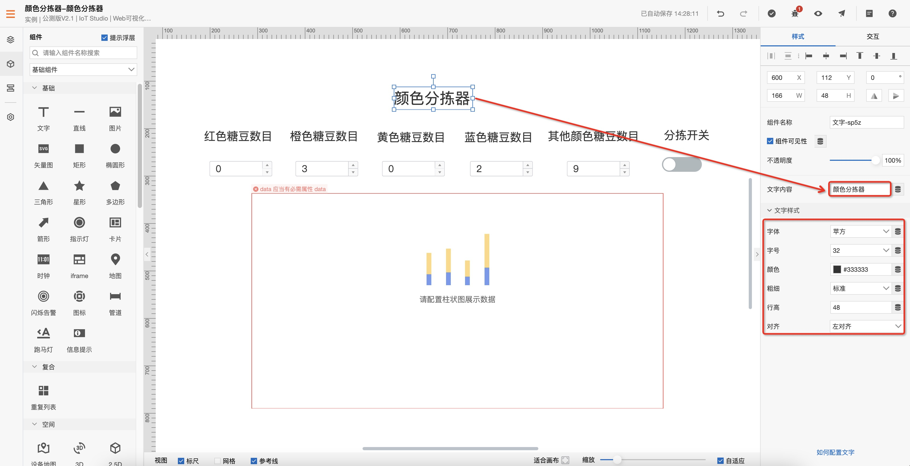

#### 4.4.2、配置数字框组件
  - 配置**红色糖豆数目**数字框
  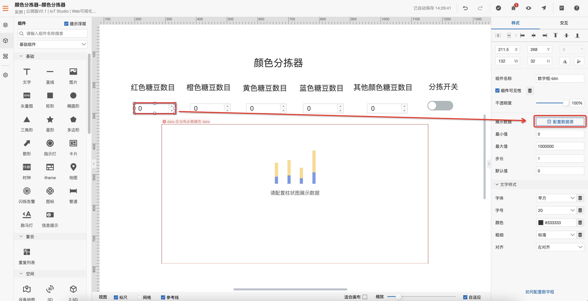
  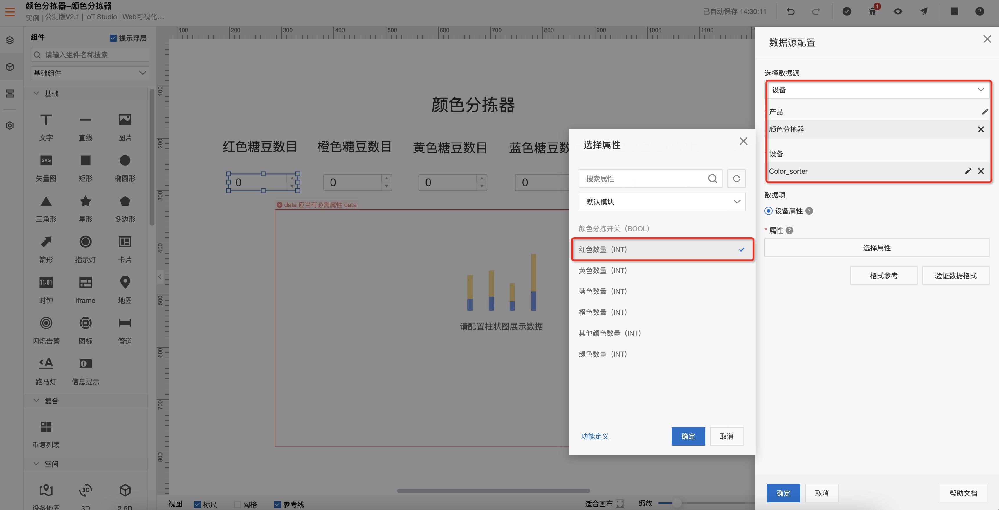
  - 配置**黄色糖豆数**数字框
  
  - 配置**蓝色糖豆数目**数字框
  
  - 配置**其他颜色糖豆数目**数字框
  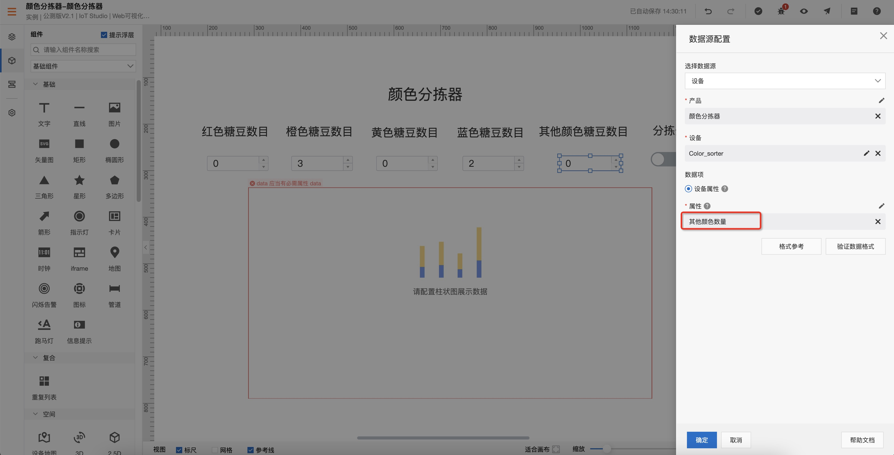

#### 4.4.3、配置开关组件
  - 配置分拣开关按钮
  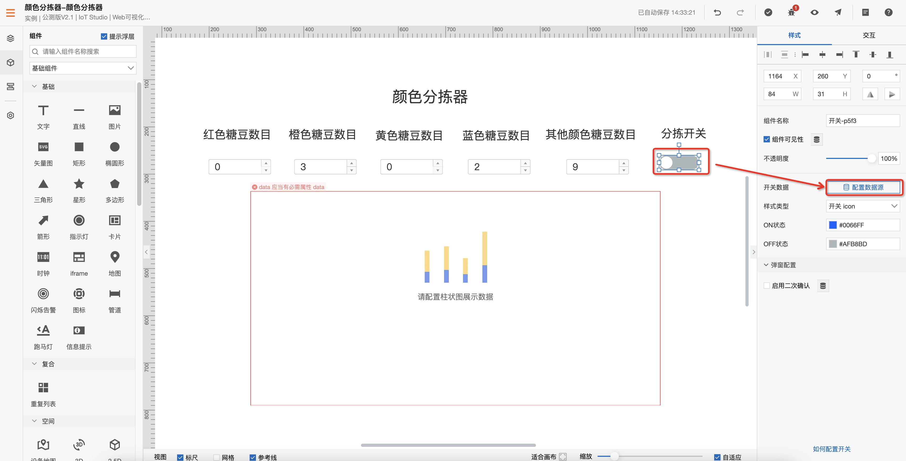
  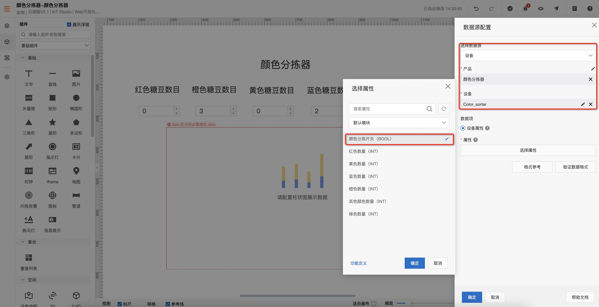

#### 4.4.4、业务逻辑开发
&emsp;&emsp;
由于柱状图组件需要使用特定的数据格式，因此在配置柱状图组件之前，需要先进行业务逻辑开发，对设备上报的属性值格式进行转换。
  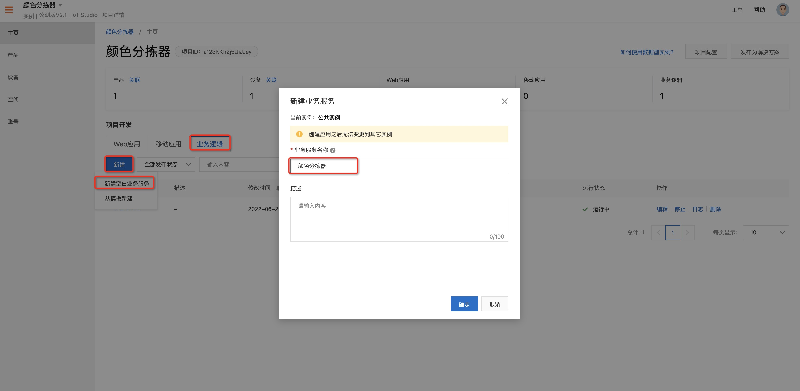
&emsp;&emsp;
在业务逻辑开发页面，我们选择设备触发、Nodejs脚本、应用推送三个节点，并连接三个节点。
  
#### 4.4.4.1、设备触发节点配置

&emsp;&emsp;
    设备触发中，需要设置触发条件为**全部属性**。
  
#### 4.4.4.2、Nodejs节点配置
  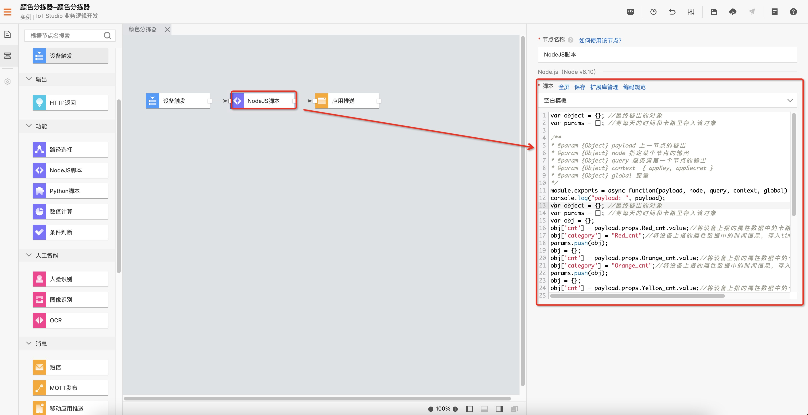

&emsp;&emsp;
在Nodejs脚本节点，需要对上一节点**设备触发**节点的数据进行整理，输出柱状图需要的格式。具体js脚本如下：（代码含义可参考注释）
```javascript
/**
* @param {Object} payload 上一节点的输出
* @param {Object} node 指定某个节点的输出
* @param {Object} query 服务流第一个节点的输出
* @param {Object} context  { appKey, appSecret }
* @param {Object} global 变量
*/
module.exports = async function(payload, node, query, context, global) {
console.log("payload: ", payload);
var object = {}; //最终输出的对象
var params = []; //将颜色种类和对应数目存入该对象
var obj = {};
obj['cnt'] = payload.props.Red_cnt.value;//将设备上报的属性数据中的颜色识别结果信息，存入cnt中
obj['category'] = "Red_cnt";//将颜色种类，存入category中
params.push(obj);
obj = {};
obj['cnt'] = payload.props.Orange_cnt.value;//将设备上报的属性数据中的颜色识别结果信息，存入cnt中
obj['category'] = "Orange_cnt";//将颜色种类，存入category中
params.push(obj);
obj = {};
obj['cnt'] = payload.props.Yellow_cnt.value;//将设备上报的属性数据中的颜色识别结果信息，存入cnt中
obj['category'] = "Yellow_cnt";//将颜色种类，存入category中
params.push(obj);
obj = {};
obj['cnt'] = payload.props.Blue_cnt.value;//将设备上报的属性数据中的颜色识别结果信息，存入cnt中
obj['category'] = "Blue_cnt";//将颜色种类，存入category中
params.push(obj);
obj = {};
obj['cnt'] = payload.props.Other_cnt.value;//将设备上报的属性数据中的颜色识别结果信息，存入cnt中
obj['category'] = "Other_cnt";//将颜色种类，存入category中
params.push(obj);
obj = {};
obj['cnt'] = payload.props.Green_cnt.value;//将设备上报的属性数据中的颜色识别结果信息，存入cnt中
obj['category'] = "Green_cnt";//将颜色种类，存入category中
params.push(obj);
object['data'] = params;
return object;
}
```
#### 4.4.4.3、应用推送节点配置
  
#### 4.4.4.4、业务逻辑调试
&emsp;&emsp;
保存业务逻辑后，点击调试按钮，进行调试。在弹出的窗口中，点击**前往**，开启模拟器。

&emsp;&emsp;
选择产品及设备，点击启动模拟器。
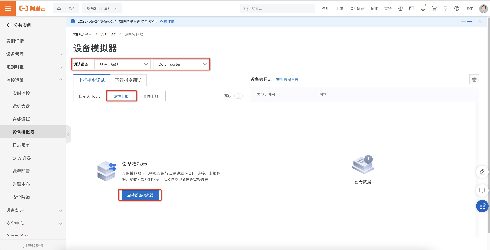
&emsp;&emsp;
在属性上报界面，输入各属性值，点击发送指令。
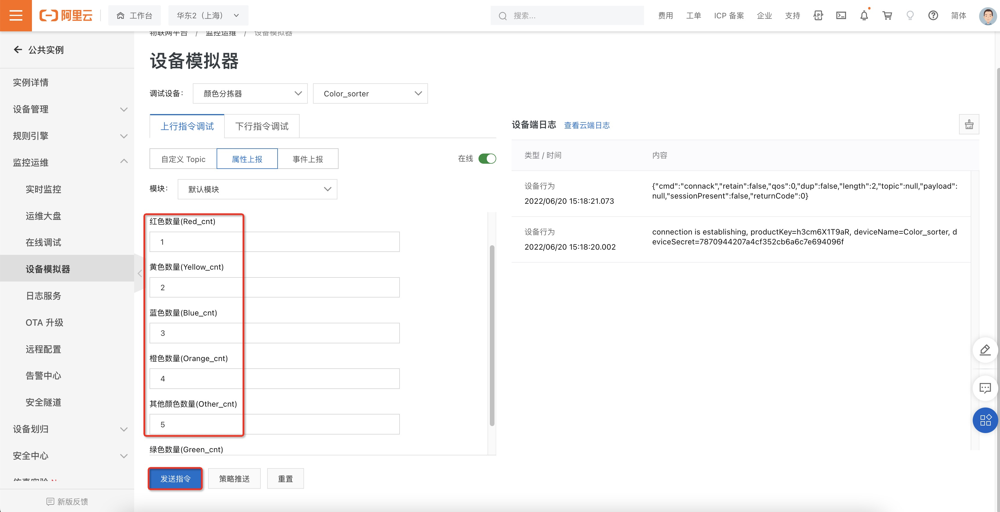
&emsp;&emsp;
回到业务逻辑开发界面，查看调试信息。

&emsp;&emsp;
在Nodejs节点输出中看到上报的属性值已经转换成柱状图需要的数据格式，说明Nodejs脚本已经生效。
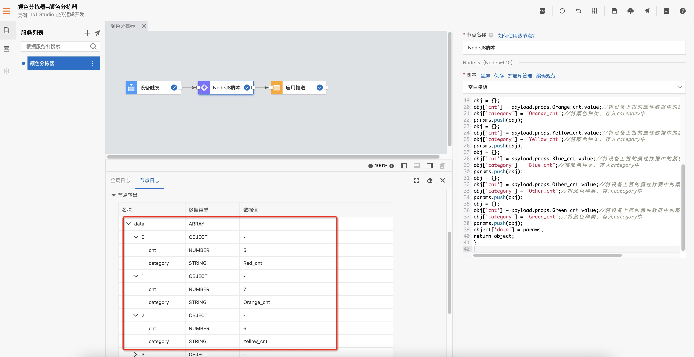
&emsp;&emsp;
在业务逻辑界面，点击发布业务逻辑。

#### 4.4.5、配置柱状图组件
&emsp;&emsp;
配置好业务逻辑后，我们可以进行柱状图配置。


由于柱状图组件需要提供数据源，选择刚刚创建的Web应用业务逻辑。
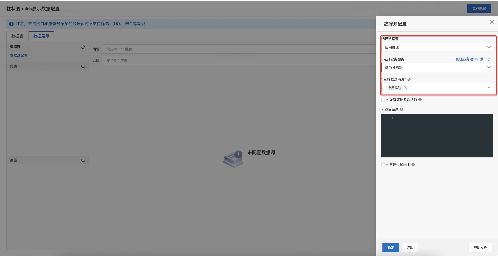
&emsp;&emsp;
需要注意，此处将数据源配置为应用推送后，返回结果的预览界面仍然是空，这是由于柱状图配置好后，尚未收到数据。在上一节中的**模拟器调试界面**，再次点击上报属性数据，就能看到返回结果预览界面出现数据。
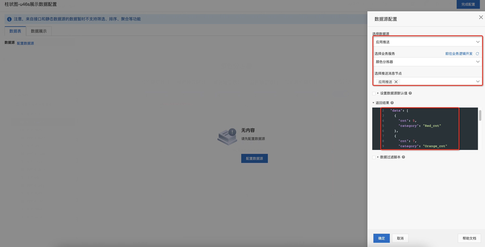
&emsp;&emsp;
将category和cnt作为横轴和纵轴拖动到指定位置后，点击右上角完成配置即可完成配置。


## 5、运行结果
### 5.1、设备功能控制说明
* 推送脚本：推送python脚本到ESP32后，程序会对舵机进行初始化，当初始化完成之后，系统已就绪，可开始工作。
* 开始运行：点击Web应用页面的**分拣开关**，将其打开，设备端就会开始识别、分拣。
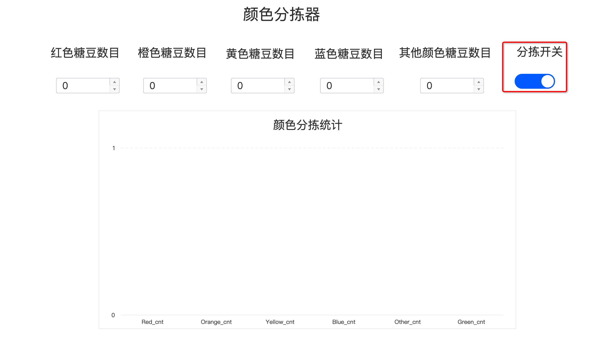
* 结束运行：点击点击Web应用页面的**分拣开关**，将其关闭，设备端就会结束运行。
### 5.2、本地运行效果
&emsp;&emsp;
推送此脚本到ESP32之后，设备端开机后，会自动运行推送的python脚本，通过PC端串口调试工具可以看到设备端打印如下日志。日志的含义为:
* “link platform connected” 代表成功连接到云端平台。
* “top_servo inited、bottom_servo inited”表示上下两个舵机初始化完成。
* “sorter_switch convert to : 1”，表示收到平台设置的属性值，打开分拣开关，设备端开始分拣。
* ”r:253, g:94, b:77“，表示颜色传感器当前检测到的RGB值。
* “detect red, cnt: 1”，表示当前RGB值对应的是红色，红色当前累计数量为1。
* "upload props-->"之后跟着的为设备端向云端上报的属性信息。
```json
establish tcp connection with server(host='xxxxx.iot-as-mqtt.cn-shanghai.aliyuncs.com', port=[443])
tcp_connect: can only connect from state CLOSED
success to establish tcp, fd=55
link platform connected
colorSensor init done
init top servo...
top_servo inited
init bottom servo...
bottom_servo inited

sorter_switch convert to : 1
r:253, g:94, b:77
detect red, cnt: 1
upload props-->{'params': '{"Other_cnt": 0, "Sorter_switch": 1, "Red_cnt": 1, "Blue_cnt": 0, "Orange_cnt": 0, "Yellow_cnt": 0, "Green_cnt": 0}'}
颜色识别结果上报成功

r:253, g:253, b:193
detect green, cnt: 1
upload props-->{'params': '{"Other_cnt": 0, "Sorter_switch": 1, "Red_cnt": 1, "Blue_cnt": 0, "Orange_cnt": 0, "Yellow_cnt": 0, "Green_cnt": 1}'}
颜色识别结果上报成功

r:253, g:253, b:253
detect yellow, cnt: 1
upload props-->{'params': '{"Other_cnt": 0, "Sorter_switch": 1, "Red_cnt": 1, "Blue_cnt": 0, "Orange_cnt": 0, "Yellow_cnt": 1, "Green_cnt": 1}'}
颜色识别结果上报成功
sorter_switch convert to : 0
```
&emsp;&emsp;
设备端运行效果：
<div align="center">

</div>

### 5.3、物联网平台端设备信息查看
&emsp;&emsp;
再次前往物联网平台的设备信息页面，若设备运行正确，此时应该可以看到设备名右侧的状态由“未激活”变为“在线”。
选中“实时刷新”，可以看到数据实时从设备上报到物联网平台。设备上云成功。

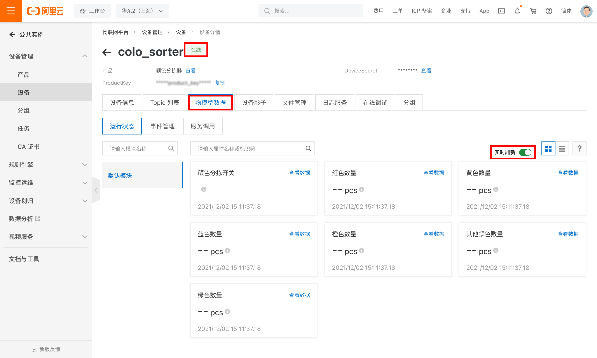
<div align="center">

</div>

### 5.4、Web应用查看设备上报结果
&emsp;&emsp;
在Web应用页面点击**分拣开关**，设备端会开始识别、分拣不同颜色的糖豆，并将识别的统计数据上报。Web端运行效果如下：
<div align="center">

</div>