# 防盗监控系统
&emsp;&emsp;
下图是本案例的四步导学。
<div align="center">

</div>

## 1、简介
### 1.1、背景
&emsp;&emsp;
日常生活中，在夜间休息或家中无人时，如果在家中存放了贵重物品，需要做好家中贵重物品的防盗工作。当门窗或存放贵重物品的柜子、抽屉被打开时，防盗报警系统需要能够及时报警，并抓拍到入侵者的图像信息。

&emsp;&emsp;
本案例采用M5Stack Core2开发板，结合干簧管传感器、蜂鸣器、摄像头等传感器，搭建了一套低成本、易实现的家庭防盗监控系统，基于阿里云物联网平台，可在手机app上进行远程监控，动态控制系统运行。

## 1.2、准备

1. [M5Stack Core2开发板](https://haas.iot.aliyun.com/solution/detail/hardware?versionId=800C84FAF561DF6A00000001&dataId=800C84FAF561DF6A) 一套
2. M5Stack Unit CAM摄像头 一个
3. 连接线 一根
4. [干簧管传感器](https://haas.iot.aliyun.com/solution/detail/hardware?versionId=800C4C5091EC2DE500000001&dataId=800C4C5091EC2DE5) 一个
5. 公对母、公对公杜邦线 若干

涉及到的硬件购买链接如下，仅供参考，不负责商家发货的品质保障等问题！

| 名称 | 数量 | 参考链接 |
| --- | --- | --- |
| M5Stack Core2开发版 | 1 | [M5Stack Core2](https://item.taobao.com/item.htm?spm=a1z10.5-c-s.w4002-22404213529.17.732749d8usCqYX&id=625561056791) |
| microUSB数据线 | 1 | M5Stack Core2开发套件自带 |
| 摄像头 | 1 | [M5Stack Unit CAM摄像头](https://item.taobao.com/item.htm?spm=a1z10.5-c-s.w4002-22404213529.29.698e2d4844EBZF&id=643872470244) |
| 连接线 | 1条 | [M5Stack GROVE连接线](https://item.taobao.com/item.htm?spm=a1z10.5-c-s.w4002-22404213529.11.6b6d5f86B5IYMF&id=610410604759) 请选用10cm长即可 |
| 干簧管传感器 | 1 | [干簧管传感器](https://detail.tmall.com/item.htm?spm=a1z10.3-b-s.w4011-16538328900.35.2fc03d6cnWnN4k&id=41210762746&rn=e2e0e6902441d7885abaed9cc81ee1ed&abbucket=11)  |
| 公对母杜邦线 | 若干 | [杜邦线](https://detail.tmall.com/item.htm?spm=a230r.1.14.22.b10c6663PCvNOq&id=41254478179&ns=1&abbucket=7&skuId=3211140814458) 请选用10cm长即可 |

&emsp;&emsp;
硬件连线图如下图所示：
<div align="center">

</div>
<br>

## 2、云端开发

&emsp;&emsp;
整个过程包含以下4个步骤：

1. 开通公共实例
2. 创建产品（设备模型）
3. 定义产品功能（物模型）
4. 创建设备及获取三元组

### 2.1、开通公共实例
&emsp;&emsp;
对于第一次使用物联网平台的开发者，需要开通实例以使用物联网平台的功能。这里可以使用免费的公共实例进行开发。

&emsp;&emsp;
在[物联网平台](https://iot.console.aliyun.com/lk/summary/new)中，左上角选择“华东2-上海”，点击“公共实例”，即可开通。开通后点击“公共实例”，即可进入[控制台](https://iot.console.aliyun.com/lk/summary/new)进行产品创建。


### 2.2、创建产品（设备模型）
&emsp;&emsp;
进入[公共实例控制台](https://iot.console.aliyun.com/lk/summary/new)，点击“创建产品”按钮，即可进入[新建产品页面](https://iot.console.aliyun.com/product)。

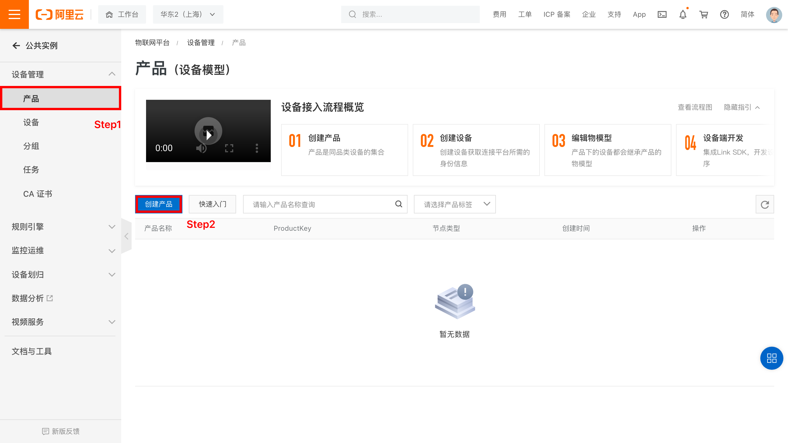

&emsp;&emsp;
进入[新建产品页面](https://iot.console.aliyun.com/product)，设定“产品名称”，这里我们命名为“**防盗报警系统**”，开发者也可以根据自己的喜好来命名。在“所属品类”中，选择“自定义品类”。

&emsp;&emsp;
产品的节点类型选择“直连设备”，数据格式选择“ICA标准数据格式”，检验类型和认证方式选择默认设定即可。开发者可根据自己的需求在“产品描述”页面添加针对此产品的描述。

&emsp;&emsp;
对于 M5StackCore2 等搭载 Wi-Fi 的设备而言，联网方式选择“Wi-Fi”。

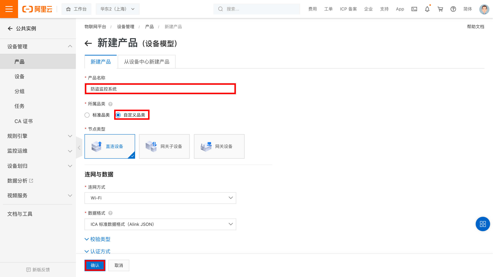

&emsp;&emsp;
点击“确认”按钮，即可完成产品创建。


&emsp;&emsp;
点击“前往定义物模型”

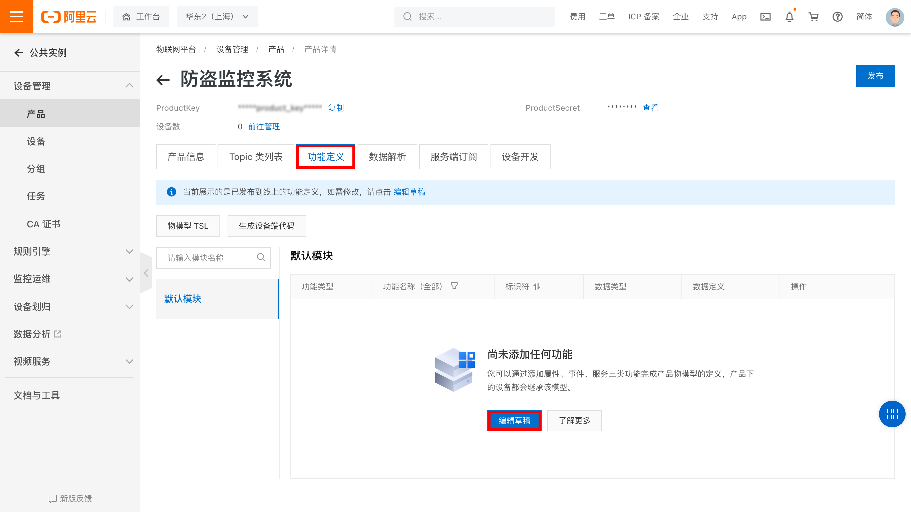

### 2.3、定义产品功能（物模型）
&emsp;&emsp;
开发者可以使用准备好的[物模型文件](./link_platform/model.zip)来进行快速导入。点击左上角“快速导入”，选择物模型文件并上传，就能够生成案例对应的物模型。

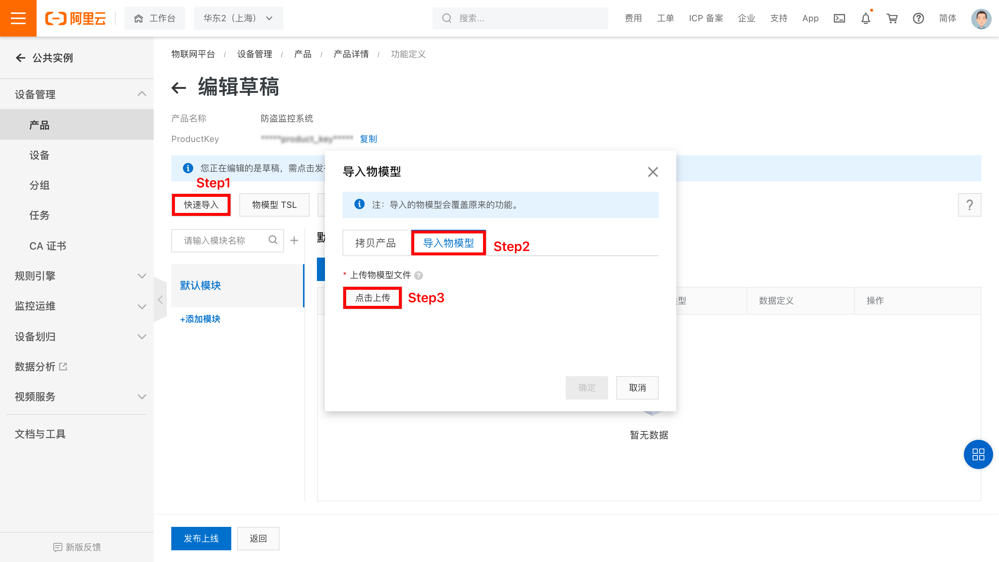

&emsp;&emsp;
生成后的效果如下：
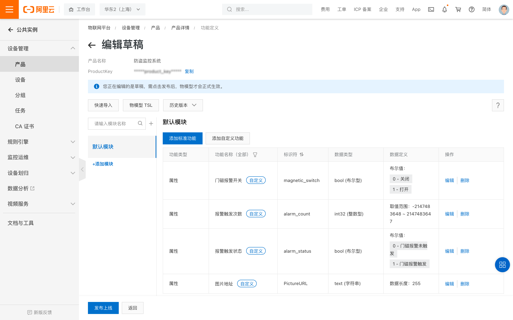

&emsp;&emsp;
定义好物模型后，需要发布物模型上线，并发布产品，以使变更生效。


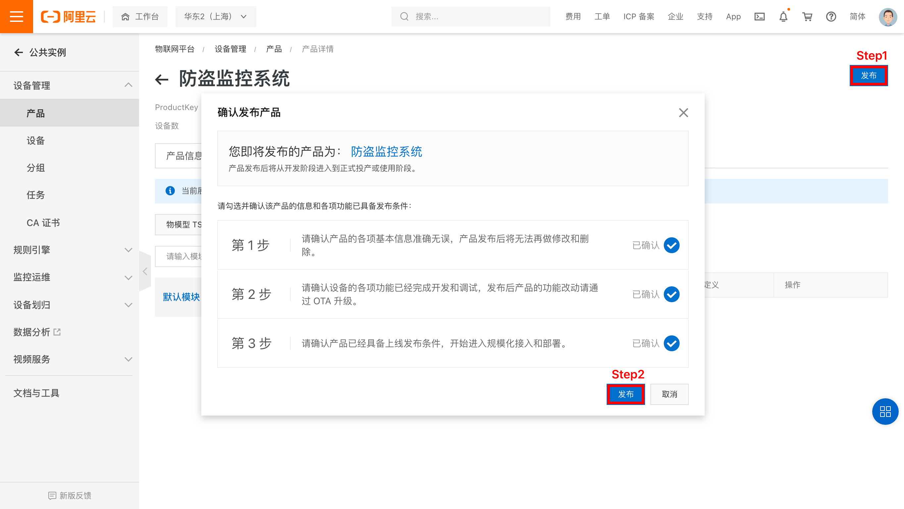

&emsp;&emsp;
产品及其物模型创建完成后就可以创建这个产品的设备了。

### 2.4、创建设备及获取三元组
&emsp;&emsp;
点击左侧栏中“设备“，在筛选框中选择要添加设备的产品，点击“添加设备”。这里这里我们命名为“**test_device**”，开发者也可以根据自己的喜好来命名。

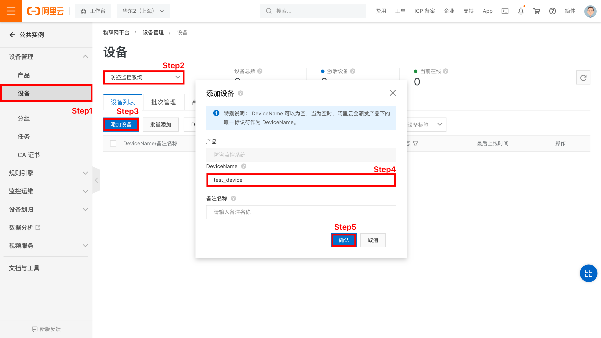

&emsp;&emsp;
开发者也可以选择“批量添加”，一次性添加多个设备，并生成随机的DeviceName。


&emsp;&emsp;
生成的设备如下。


&emsp;&emsp;
点击前往“查看”按钮，就可以看到此设备的详细信息了。


&emsp;&emsp;
点击右上角的“查看”按钮，就能看到设备的三元组信息了。
三元组是物联网设备端和物联网云端设备相关联的唯一标识符，在设备端连接云端的时候会使用三元组信息和云端进行鉴权，鉴权通过之后云端会认为设备已激活并上线。


&emsp;&emsp;
再次前往物联网平台的设备信息页面，若设备运行正确，此时应该可以看到设备名右侧的状态由“未激活”变为“在线”。
选中“实时刷新”，可以看到数据实时从设备上报到物联网平台。设备上云成功。

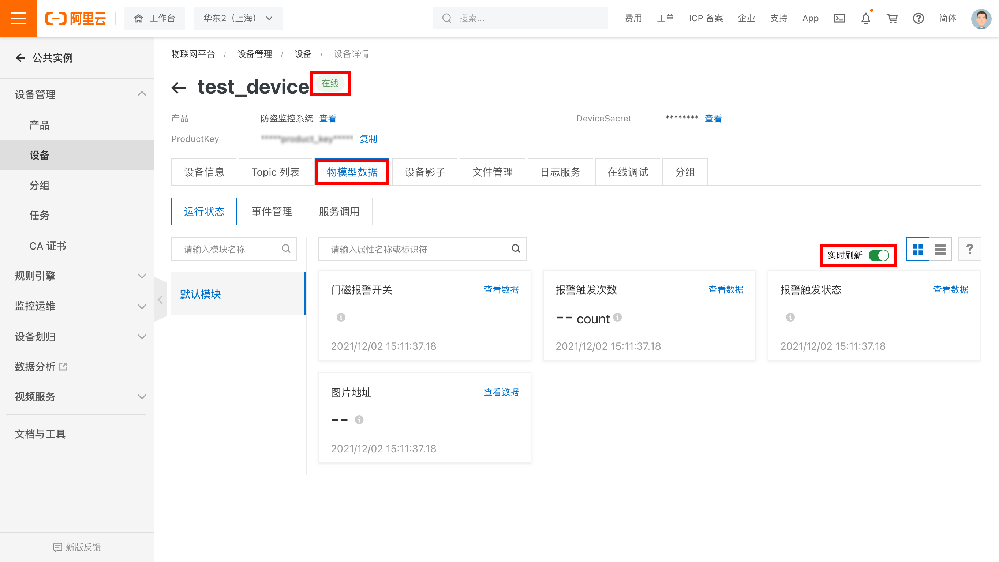

## 3、物联网应用开发

&emsp;&emsp;
IoT Studio 提供了应用快速开发的能力，可以很方便地与物联网平台进行联动。本节的开发工作也将围绕 IoT Studio展开。

### 3.1、新建“普通项目”

&emsp;&emsp;
打开IoT Studio官网，在项目管理中新建一个空白项目，如下图所示，将此项目命名为“**防盗报警系统**”,开发者也可以根据自己的喜好来命名。

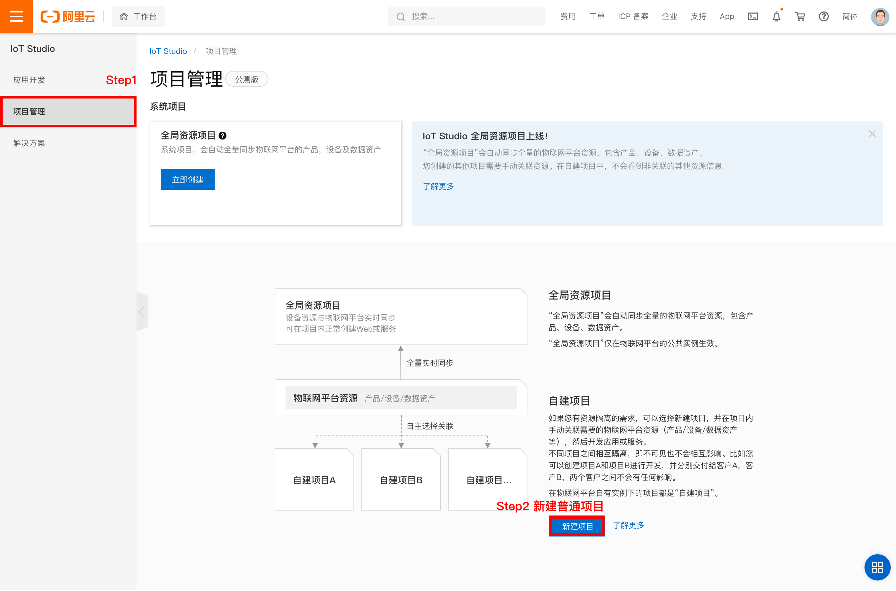

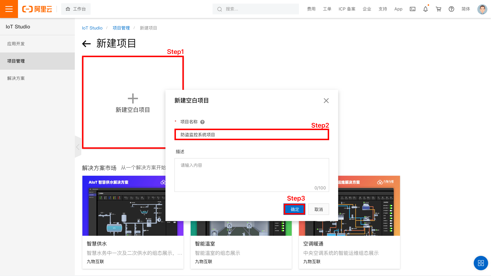

### 3.2、关联产品

&emsp;&emsp;
为了使本项目能够获取到目标设备的属性信息，我们首先需要将该项目和我们在前一节创建的产品“防盗报警系统”绑定。

&emsp;&emsp;
在项目控制台，点击左侧的“产品”，点击“关联物联网平台产品”。此时可以看见我们创建的“防盗报警系统”。点击选中，并勾选“关联产品同时关联其下所有设备”，以便该项目可以访问到所有设备的属性信息。


### 3.3、创建“移动应用”


### 3.4、“移动应用”开发
&emsp;&emsp;
从左侧组件栏中选择防盗报警系统app需要的组件，将其拖入中间的窗口，按自己的喜好进行布局。本案例中，选择了时钟、实时曲线、开关、指示灯、图片、文字等组件。具体配置过程如下：

#### 3.4.1、配置图表组件
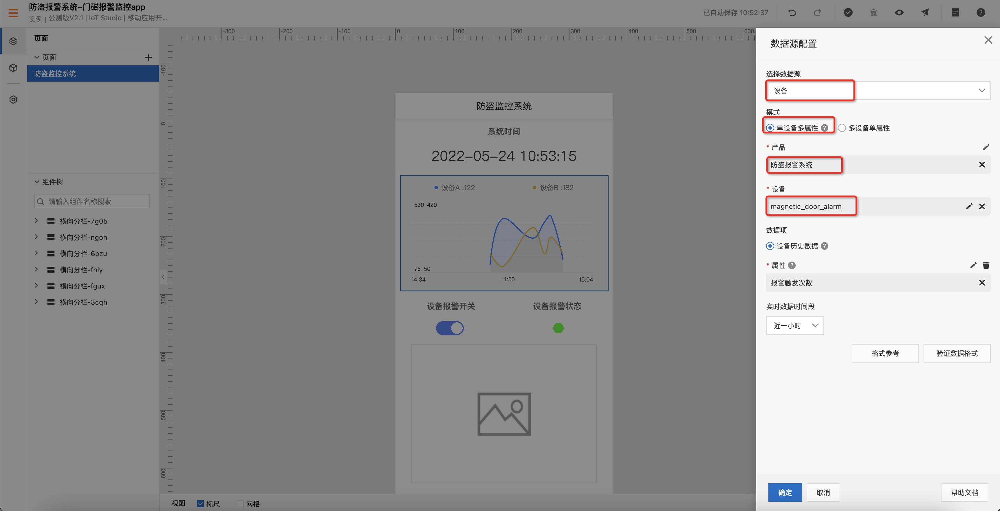
#### 3.4.2、配置开关组件
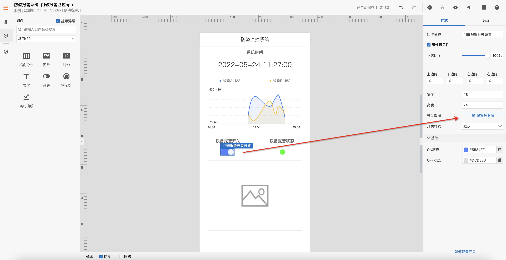
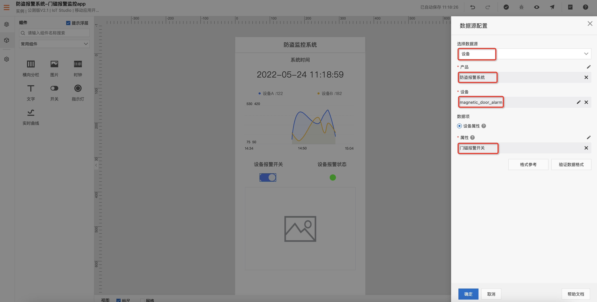
#### 3.4.3、配置指示灯组件
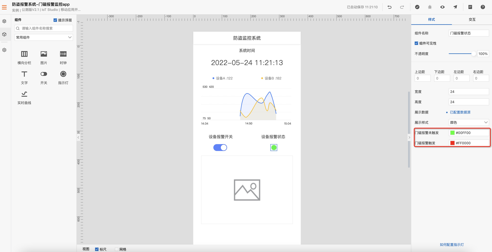
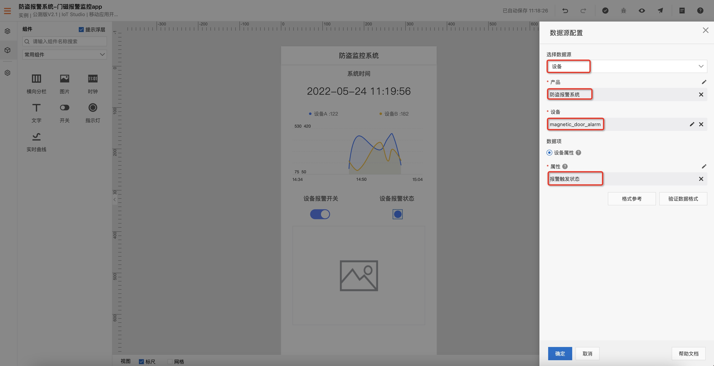
#### 3.4.4、配置图片组件
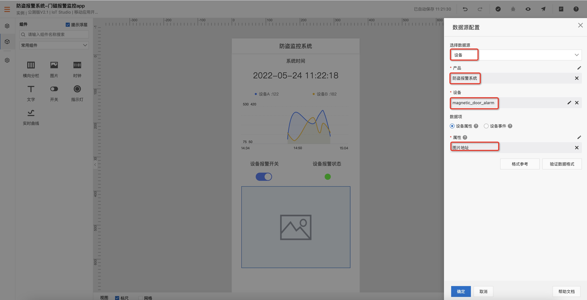

### 3.5、HaaS Cloud平台配置
&emsp;&emsp;
由于需要用到HaaS聚合服务中工具服务能力，获取图片url，因此需要在HaaS Cloud平台绑定物联网平台产品。

&emsp;&emsp;
进入[HaaS官网](https://haas.iot.aliyun.com/)
使用阿里云账号登陆后，点击右上角“控制台”。


&emsp;&emsp;
进入HaaS Cloud平台的控制台页面：
在左侧导航栏“设备管理”下，可以看到“产品”和“设备”两个选项，点击“产品”，点击“绑定物联网平台产品”，在右侧弹出的标签页中勾选我们刚刚创建的“**防盗报警系统**”，点击确定完成关联。

 

&emsp;&emsp;
在左侧导航栏“设备管理”下，点击“设备”，选择关联的产品，即可看到关联的设备列表。此时可以看到“**test_device**”出现在了列表中，证明关联成功。

 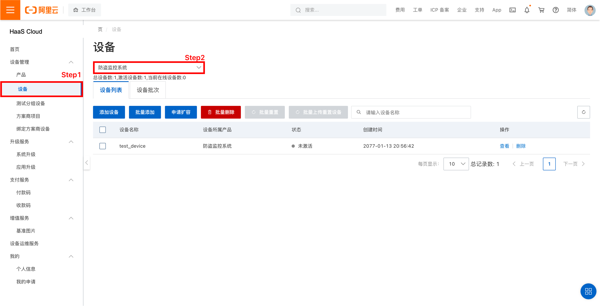


## 4、设备端开发

### 4.1、开发环境准备
&emsp;&emsp;
在进行下一步之前请确保ESP32中已经烧录了HaaS Python固件并且其开发环境已经搭建完毕。详情请参考[M5StackCore2开发环境](../../../startup/M5StackCore2_startup.md)的说明。
<br>

### 4.2、创建解决方案

&emsp;&emsp;
如下图所示，打开VS Code之后在新建一个基于helloworld的python工程，设定好工程名称（“security_monitoring_system”）及工作区路径之后，硬件类型选择"m5stackcore2"，点击”立即创建“，创建一个Python轻应用的解决方案。

<div align="center">

</div>


&emsp;&emsp;
将[防盗报警系统代码](./code/)文件下的所有脚本进行复制到“security_monitoring_system”工程目录下，然后进行如下设定完成设备端代码的开发。
> Python脚本的详细说明请参考脚本内嵌的文字注释


1. **修改路由器名称及密码**

&emsp;&emsp;
修改security_monitoring_system工程里main.py中SSID和PWD的值为开发者实际要连接的路由器的名称及密码（请注意名称和密码都需要放在''符号中间）。

```python
# Wi-Fi SSID和Password设置
SSID='Your-AP-SSID'
PWD='Your-AP-Password'
```

&emsp;&emsp;
修改完成之后connect_wifi函数就会连接开发者自己设定的路由器。

2. **修改设备的三元组信息**

&emsp;&emsp;
按照创建产品、设备步骤获取三元组信息，填入main.py中：
```python
# HaaS设备三元组
productKey = "Your-ProductKey"
deviceName  = "Your-devicename"
deviceSecret  = "Your-deviceSecret"
```

&emsp;&emsp;
最后点击VSCode中HaaS Studio工程底部的部署运行或串口，选择对应的端口编号烧录程序。

&emsp;&emsp;
推送此脚本到M5StackCore2之后，通过PC端串口调试工具可以看到设备端打印如下日志。日志的含义为:
* “link platform connected” 代表成功连接到云端平台。
* "upload--->"之后跟着的为设备端向云端发送的请求信息，其中"eventName"为"saveImageTest"，表示调用云端增值服务中的获取图片url信息功能。
* "download <----"之后跟着的是收到云端回复的识别结果信息：
    - result：url是否获取成功。（success：成功，failed：失败）
    - imageUrl：返回的图片url链接地址
    - commandName：saveImageTestReply表明该消息是saveImageTest服务的返回信息。
```json
establish tcp connection with server(host='h3cmtQJN1wy.iot-as-mqtt.cn-shanghai.aliyuncs.com', port=[443])
tcp_connect: can only connect from state CLOSED
success to establish tcp, fd=55
link platform connected
megnetic detector ...

upload--->{'qos': 1, 'payload': '{"version": "1.0", "id": 1, "params": {"ext": "{\\"fileName\\": \\"test.jpg\\", \\"enlarge\\": 1, \\"filePosition\\": \\"lp\\", \\"fileId\\": \\"xxxxx\\"}", "eventType": "haas.faas", "eventName": "saveImageTest", "argInt": 1}}', 'topic': '/sys/xxx/xxxxx/thing/event/hli_event/post'}
recognize time : 1629

download <----{'msg_id': 140514731, 'service_id': 'hli_async_service', 'params': '{"ext":"{\\"imageUrl\\":\\"http://vibktprfx-prod-prod-aic-vc-cn-shanghai.oss-cn-shanghai.aliyuncs.com/sisrx2/22-05-24-01/7d05e6fd-fcba-4309-b3c8-c31f12b549a4.png?Expires=xxx&OSSAccessKeyId=xxx&Signature=xxx\\",
\\"result\\":\\"success\\"}","commandName":"saveImageTestReply","commandType":"haas.faas","argInt":1}', 'code': 0, 'params_len': 360}
```

## 5、端云连调
### 5.1、云端查看设备上报结果
&emsp;&emsp;
此时如果拉开抽屉，触发干簧管传感器，蜂鸣器会发出响声，app页面的报警指示灯会变成红色，同时摄像头上传抓拍到的图像。
<div align="center">

</div>

&emsp;&emsp;
接着通过云端设置报警开关状态为“关闭”，也可以手机扫码设置，此时在VSCode可以看到如下log显示。之后如果再次出发干簧管传感器，app页面的指示灯保持绿色，同时蜂鸣器也不会报警。
日志的含义为:
* “magnetic_switch set value : 0” 表示收到平台下发的设置报警开关消息。
    - 0:表示关闭报警开关；
    - 1:表示打开报警开关；
* "upload props--->"之后跟着的为设备端向物联网平台发送的属性信息，其中包括四个属性：
    - PictureURL：返回的图片url链接地址，用于在移动应用中展示抓拍的图像。
    - alarm_status：当前设备报警状态。
      - 0:设备未报警，对应移动应用app中设备报警状态指示灯为**绿色**。
      - 1:设备报警，对应移动应用app中设备报警状态指示灯为**红色**。
    - magnetic_switch：设备报警开关。
      - 0:关闭报警开关，此时若干簧管传感器触发，也不会产生报警。
      - 1:打开报警开关，此时若干簧管传感器触发，则会报警，蜂鸣器发出声音，抓拍入侵者图像，上报平台。
    - alarm_count：设备报警触发次数，用于移动应用app统计展示。
```log
magnetic_switch set value : 0
upload props-->{'params': '{"PictureURL": "", "alarm_status": 0, "magnetic_switch": 0, "alarm_count": 1}'}
```

&emsp;&emsp;
扫描二维码后，打开监控app，此时在手机端就可以看到如下监控曲线，当传感器触发时，可以看到摄像头抓拍到的图像。

&emsp;&emsp;
注意：这里的二维码有效期24小时，如需发布长期使用，请在阿里云[域名注册](https://wanwang.aliyun.com/)申请独立域名后在Iot Studio配置才可。
<div align="center">

</div>

### 5.2、设备端效果
&emsp;&emsp;
将开发板、摄像头、蜂鸣器、干簧管传感器、磁铁等传感器固定好，当抽屉被拉开时，由于干簧管传感器与磁铁分离，产生信号，屏幕上会打印"WARNING"字样，蜂鸣器发出声音，能够有效震慑入侵者。

<div align="center">

</div>